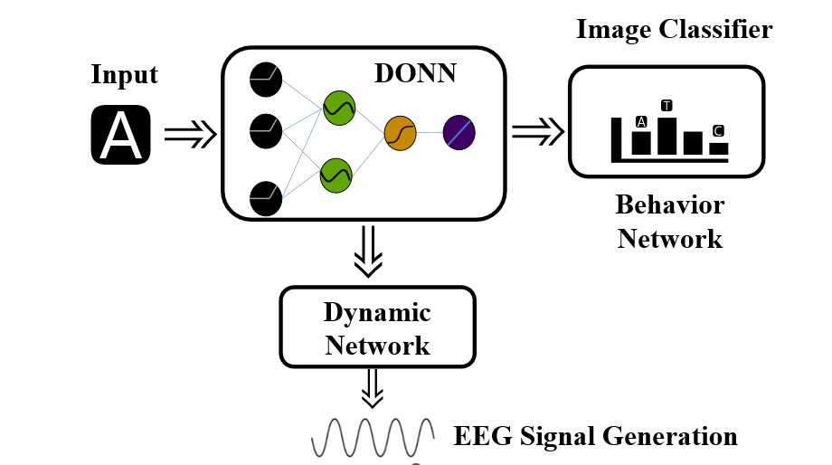
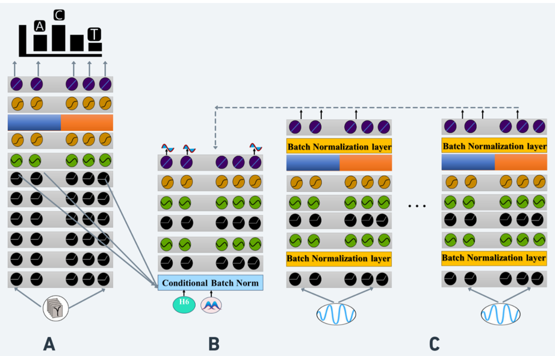
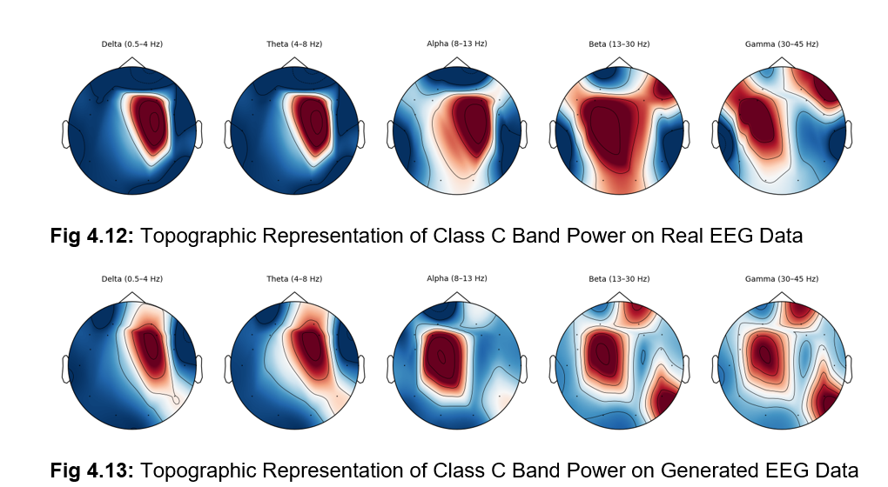

# Classifier-guided Deep Oscillatory Neural Networks (cDONN) for capturing both Neural Dynamics and Behavior simultaneously

## Overview

This repository implements **Classifier-guided Deep Oscillatory Neural Networks (cDONN)**, a novel architecture that simultaneously captures neural dynamics and behavioral patterns through EEG signal generation. The system combines image classification with dynamic neural network modeling to generate realistic EEG signals corresponding to specific behavioral states.

## Architecture



The cDONN system consists of three main components:

1. **Image Classifier**: Processes input stimuli and generates behavioral predictions
2. **Dynamic Oscillatory Neural Network (DONN)**: Converts behavioral states into neural dynamics  
3. **EEG Signal Generator**: Transforms neural dynamics into realistic EEG signals

## Network Architecture Details



The system employs a sophisticated multi-layer architecture with:
- **Conditional Batch Normalization layers** for adaptive signal processing
- **Multi-channel processing** for different EEG frequency bands
- **Dynamic network components** that adapt based on behavioral states

## Directory Structure

```
├── Figures/                    # Architecture diagrams and visualizations
├── Results-Analysis/           # EEG analysis results and outputs
├── Training Code/              # Training scripts and utilities  
├── Weights/                    # Pre-trained model weights
└── README.md
```


### 3. Results Analysis
- EEG signal analysis and validation
- Behavioral correlation studies
- Performance metrics and visualizations
- Results stored in `Results-Analysis/`

## Getting Started

### Prerequisites
- Python 3.10+
- Tensorflow keras
- NumPy
- Matplotlib
- Jupyter Notebook

### Installation
```bash
git clone https://github.com/Sap27/cDONN
cd cDONN
```

### Usage
1. Load pre-trained weights from the `Weights/` directory
2. Run training scripts from `Training Code/` directory
3. Analyze results using notebooks in `Results-Analysis/`

## Data
The dataset used in the study is available in the hf repo Sap27/cDONN

## Training

The training process involves:
1. Training the image classifier on behavioral data
2. Training the signal generator network with EEG data alongside system of weak evaluator networks

Training scripts are available in the `Training Code/` directory.

## Results

Comprehensive analysis results including:
- EEG signal quality metrics (IS/FID/Power Spectrum ANalysis, Data Augmentation studies)
- Behavioral prediction accuracy


All results and visualizations are stored in the `Results-Analysis/` directory.

